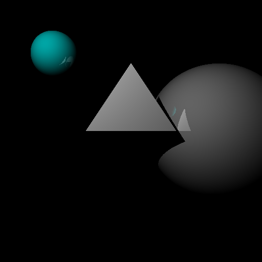

# SaphRay
SaphRay is a simple raytracer, created from scratch for learning purposes. 

It is made by Phil Gosch using C++ and CMake.

A roadmap for future development can be found here: https://trello.com/b/en6VcfRl/saphray

# Rendered images with version 0.1:

Reflections

Stl triangle mesh rendering

Multiple point lights sources

Lambertian Shading

